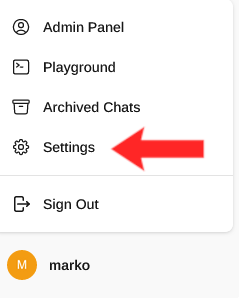
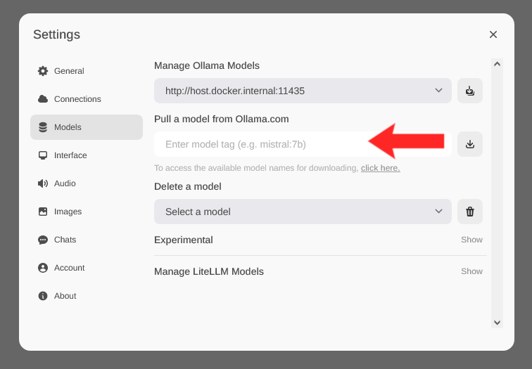

<a href="https://kida-bmel.de/"> </a><br><br><br>

# LLM-Tutorial


## Open-WebUI   
- [Getting started (Docker)](#getting-started-docker)
- [Getting started (Docker compose)](#getting-started-docker-compose)
- [Pulling Models](#pulling-models)
- [Create a Modelfile](#create-a-modelfile)
- [Acknowledgements](#acknowledgements)
### Getting started (Docker)

To use Ollama and the Open-WebUI, you first have to create docker containers for them.

##### Ollama
```
docker run -d -v [path-to-store-ollama-models]:/root/.ollama --name ollama ollama/ollama
```
This starts the ollama container in detached mode without GPU support. The volume option is not necessary, but it stores the models in a persistent folder. To use the volume, substitute `[path-to-store-ollama-models]` with an actual path.

##### Open-WebUI
For Open-WebUI, you can use a `.env` file to store environment variables that will be used in this container. Create a `webui.env` file with the following content:
```
DEFAULT_USER_ROLE=admin
ENABLE_ADMIN_EXPORT=False
```
Run the WebUI docker container with the following command (substitute `[path-to-webui.env]` with the actual path):
```
docker run -d -p 3000:8080 --add-host=host.docker.internal:host-gateway -v open-webui:/app/backend/data --env-file [path-to-webui.env] --name open-webui_test --restart always ghcr.io/open-webui/open-webui:main
```
If you don't want to use the .env file, you can add `-e DEFAULT_USER_ROLE=admin -e ENABLE_ADMIN_EXPORT=False` to the docker run command instead of `--env-file [path-to-webui.env]`.

### Getting Started (Docker compose)

We provide a series of Docker compose files for easy deployment of Open-WebUI and Ollama containers and optionally some container stacks for hardware and usage monitoring.   
You can find them together with a detailed description in [compose](compose/)

### Pulling models
There are three ways to pull models in the container.  
##### 1. Copy the model files from outside into the mounted model folder (referenced in `[path-to-store-ollama-models]`)
In the `[path-to-store-ollama-models]` should be a "models" folder, in which the "blobs" & "manifest" folders are.
##### 2. Use a bash command to pull the model 
```
sudo docker exec -t ollama ollama pull mistral:7b
```
This command would pull the model mistral into the Ollama container. Replace `mistral:7b` with the model of your choice.

##### 3. Use the Open-WebUI GUI
To use the WebUI, go to `[ip-address*]:3000` in your browser, and log in/register as a new user. Then, click on your username in the lower left corner, and in the dropdown menu choose `Settings`.  
(\* Use the ip-address of the machine where the docker containers are running on. For testing, you could also use a port forwarding in VS Code and then use `localhost:3000`.)  
  

In the `Settings` menu, go to `Models`, and enter a model name in the field below "Pull a model from Ollama.com"

### Create a Modelfile
To e.g. limit the number of threads a model has, you can create a modelfile. The easiest way to do this is via the WebUI GUI.  
In the left sidebar, click on `Modelfiles`. Then, click on "Create a modelfile".  
In the template, you can choose a name, tag and description for your model, and choose a category (this seems to be a required field). In the `Content` field, you can set your parameters, like temperature. To create a e.g. llama3 model for cpu only with 16 threads, use the following template:
```
FROM llama3:latest
PARAMETER num_gpu 0
PARAMETER num_thread 16
```
Then, click on `Save & Create`. The model can then be selected as a new model from the model dropdown menu in a chat.

# Acknowledgements
This repository was created within the AI Consultancy Unit of the [KIDA](https://www.kida-bmel.de/) project. Special thanks go out to the **KIDA** project itself, as well as to the **Bundesministerium für Ernährung und Landwirtschaft** ([BMEL](https://www.bmel.de/EN/Home/home_node.html)) and the  **Bundesanstalt für Landwirtschaft und Ernährung** ([BLE](https://www.ble.de/EN/Home/home_node.html;jsessionid=A4031344815BC0EF18CBD4EF1C05FBC0.internet962)) for funding the project.
