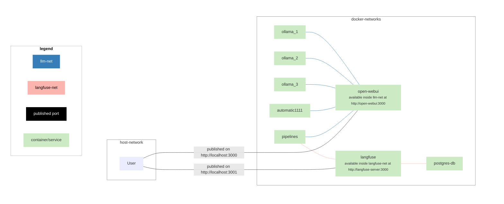

# Open WebUI Deployment using Docker compose

## complete Open WebUI stack with docker compose
In the provided compose files we imploy a couple of services:
- of course the Open WebUI container
- one or more Ollama container
- and optionally as a backend for image generation via stable diffusion
  - automatic1111 container (build with custom [Dockerfile](automatic1111.Dockerfile))
  - comfyUI container (build with custom [Dockerfile](comfyUI.Dockerfile))

In order to deploy all services (per default we deploy 3 instances of ollama for load balancing) simply setup the necessary directory structure for the automatic1111/comfyUI container (if needed, optional):

```bash
source setup.sh
```

then simply build / spin everything up with:

```bash
docker compose up -d
```

## Monitoring using langfuse
By default docker compose will not spin up the necessary container (postgres, langfuse and openwebui/pipelines) to start monitoring the usage of open-webui. In order to be able to use this, use the non-default docker compose file [`docker-compose-langfuse.yml`](docker-compose-langfuse.yml) when running the docker compose commands:
```
docker compose -f docker-compose-langfuse.yml up -d
```
There are a few manual steps in order to set this up:
1. Once all containers are running head to https://localhost:3001 where you'll find your brand new langfuse instance
    1. create an account (this can be done with an arbitrary/fake name and mail)
    2. create a project
    3. create API keys
2. head to the open-webui at http://localhost:3000 and connect the pipeline service as described in [step 2 here](https://github.com/open-webui/pipelines/tree/main?tab=readme-ov-file#-quick-start-with-docker) - here you should use `http://pipelines:9099`
3. take/download [langfuse_filter_pipeline.py](langfuse_filter_pipeline.py) and customize it in lines 53-55 with your API-keys (secret and public key created in step 1.3) and change the host to `http://langfuse-server:3000`. 
4. head to **Admin Settings > Pipelines** and upload your customized 

The docker containers are setup in two separate docker networks and only the pipelines container is connected to both:


